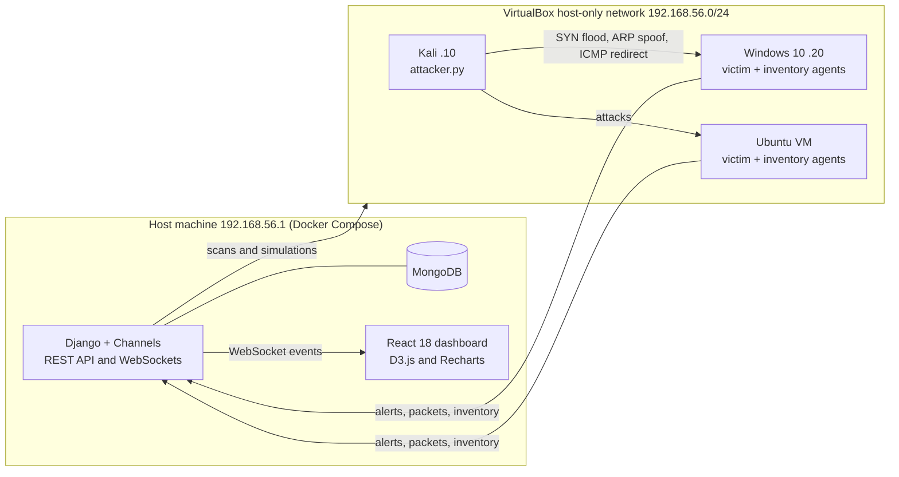

# ReconTool: real-time network intrusion detection platform

A lab SOC platform that runs network reconnaissance, replays common layer-2/layer-3 attacks, and detects them in real time on the targeted endpoints. Alerts are mapped to MITRE ATT&CK, scored per host, and streamed live to a React dashboard.

Built as my 4th-year project (PFA) at EMSI Casablanca.

> **Lab use only.** Scanning and attack modules are restricted to the subnet set in `SCAN_ALLOWED_SUBNET` (default `192.168.56.0/24`, a VirtualBox host-only network). Never run them on a network you don't own.


---

## What it does

**Detection on the endpoint.** A Python/Scapy agent runs on each monitored VM (Windows 10 or Ubuntu), sniffs local traffic and raises alerts for SYN floods, ARP spoofing and ICMP redirects. It can block the source automatically with `iptables` (Linux) or `netsh advfirewall` (Windows), with a cooldown so the same IP isn't blocked repeatedly.

**Detection on the platform.** The backend watches its own scan sessions for port sweeps (3 or more distinct ports from one source within 10 s), SYN flood signals (200 or more SYNs to one port within 10 s) and ARP anomalies (same IP, new MAC).

**Reconnaissance.** ARP host discovery, SYN and UDP port scanning, and passive OS fingerprinting from TTL and TCP window size.

**Attack simulation.** ARP spoofing, SYN flood and ICMP redirect, launched from the dashboard or from a standalone Kali script, and stoppable at any time through a thread registry.

**SOC features.**
- MITRE ATT&CK mapping for every alert, driven by a JSON rules file
- Per-host risk score from 0 to 100, based on exposed risky services (FTP, Telnet, SMB, RDP, Redis…), vulnerabilities and failed logins
- Endpoint inventory and heartbeat: an agent silent for 5 minutes is marked offline and raises an `agent_offline` alert
- Audit log of every scan, fingerprint, attack and alert
- PDF session reports generated with ReportLab

### ATT&CK coverage of implemented detections

| Detection | Technique | Tactic |
|---|---|---|
| Port sweep / scan | T1046 Network Service Discovery | Discovery |
| ARP spoofing | T1557 Adversary-in-the-Middle | Credential Access |
| ICMP redirect | T1557 Adversary-in-the-Middle | Credential Access |
| SYN flood | T1498 Network Denial of Service | Impact |

---

## Architecture



| Component | Stack |
|---|---|
| Backend | Python, Django 4.2, Django REST Framework, Django Channels, Daphne (ASGI) |
| Packet engine | Scapy 2.5 |
| Storage | MongoDB 6 with MongoEngine |
| Front end | React 18, D3.js, Recharts, Tailwind CSS |
| Reporting | ReportLab |
| Deployment | Docker Compose (MongoDB, Django, React behind Nginx) |

---

## Quick start

**1. Lab network.** In VirtualBox, create a host-only network `192.168.56.1/24` and attach the Kali and victim VMs to it. Give Kali `.10` and Windows `.20`.

**2. Platform (host machine).**

```bash
cd recon-tool
cp .env.example .env        # then set DJANGO_SECRET_KEY, AGENT_TOKEN and admin credentials
docker compose up --build
```

Dashboard: http://localhost:3000. API: http://localhost:8000/api/

**3. Agents (each victim VM, as Administrator / root).** On Windows, install [Npcap](https://npcap.com) first.

```bash
pip install scapy requests psutil
python agents/inventory_agent.py --agent-id windows10 --agent-token <AGENT_TOKEN> \
  --dashboard-url http://192.168.56.1:8000/api/agents/inventory/
python agents/victim_agent.py --agent-name windows10 \
  --dashboard-url http://192.168.56.1:8000/api/alerts/ \
  --packet-url http://192.168.56.1:8000/api/packets/
```

Add `--install-autostart` to install them as a startup task (Windows) or systemd service (Linux).

**4. Attack from Kali.**

```bash
sudo python agents/attacker.py   # 1 = SYN flood, 2 = ARP spoof, 3 = ICMP redirect
```

Alerts appear on the dashboard within seconds. Check agent status with `curl http://localhost:8000/api/agents/health/`.

The detailed French setup guide is in [`docs/SETUP_FR.md`](docs/SETUP_FR.md).

---

## API overview

| Group | Endpoints |
|---|---|
| Scans | `scan/host-discovery/`, `scan/port-scan/`, `scan/os-fingerprint/` |
| Simulation | `attack/arp-spoof/`, `attack/syn-flood/`, `attack/icmp-redirect/`, `attack/stop/`, `threads/` |
| Agent ingest | `alerts/`, `packets/`, `agents/inventory/` (token-authenticated) |
| Agents | `agents/registry/`, `agents/health/`, `agents/inventory/latest/` |
| Analysis | `mitre-mapping/`, `hosts/<ip>/risk-score/`, `audit-logs/` |
| Reporting | `results/<session_id>/`, `report/<session_id>/pdf/` |

---

## Known limitations

This is a lab prototype, and I document its limits on purpose:

- Dashboard login is checked in the browser against build-time variables. It keeps the demo simple, but it is not real authentication; server-side auth (Django sessions or JWT) is the next step.
- Detection is threshold-based. It catches the simulated attacks reliably but has no baseline of normal traffic, so it would be noisy on a real network.
- Agent-to-backend traffic uses a shared token over plain HTTP, acceptable on an isolated host-only network only.

## Roadmap

- Server-side authentication and role-based access
- Forward alerts to Wazuh so ReconTool can feed a full SIEM/SOAR pipeline
- Statistical baselining to reduce threshold false positives

---

**Author:** Mohamed Reda Karrach, cybersecurity engineering student, EMSI Casablanca. Supervised by Mr. Mouloud Afouaar.
